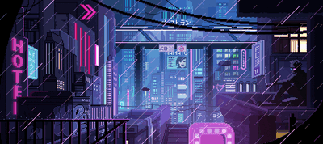

<!-- markdownlint-disable MD041 -->

  
  
  
  
  
  
  
  

# Welcome to my humble repo

I'm bruno and here is where I cook up some automation recipes, sprinkled with a dash of AI art experiments. You might accidentally find some of these ingredients in my kitchen:

> _"Code until it works, test until it breaks, art until it makes sense, nya~"_  
> _— 🐈‍⬛ Mr Meowgi_

## Currently working on

### Cowsayco

Twitter bot that posts curated developer dad jokes and quotes daily, check it out (the repos are [bot](https://github.com/brun0vop/cowsay), [page](https://github.com/brun0vop/cowsay.co))

> click image

## Get in Touch

- [Twitter](https://twitter.com/brun0vop)
- [LinkedIn](https://linkedin.com/in/brun0vop/)
- [GitHub](https://github.com/brun0vop)
- [Discord](https://discord.gg/AAH6UZ4H)
- [Facebook](https://www.facebook.com/brun0vop)
- [Buy Me a Coffee](https://buymeacoffee.com/m3auso)

  

[]

